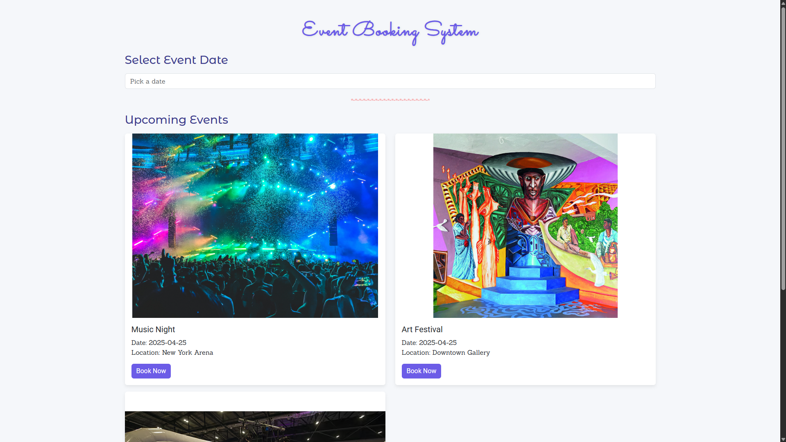
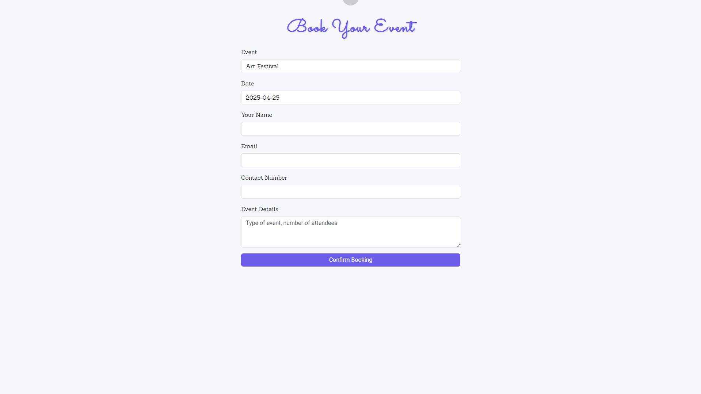
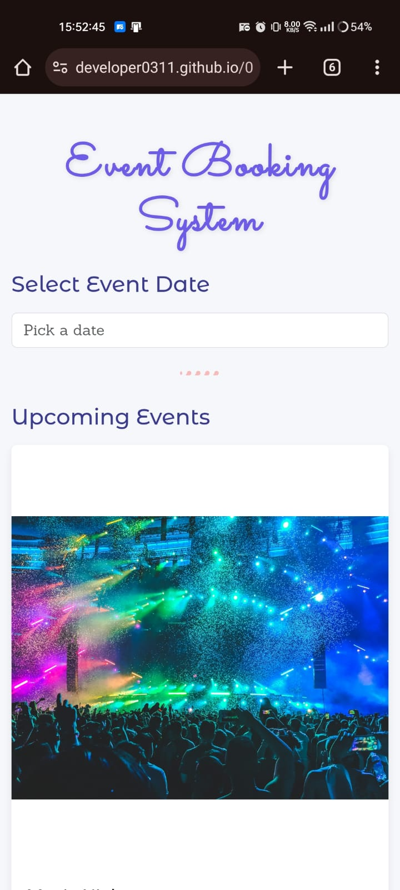
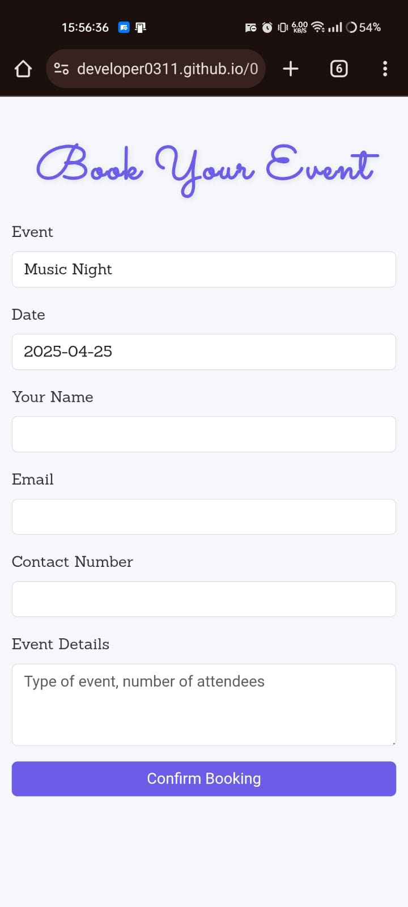

# 🎉 **Event Booking System**

This project is an **Event Booking System** 🎟️ where users can select a date using a calendar 🗓️ and view upcoming events. It dynamically loads event cards with essential info, and users can book them by clicking the **Book Now** button 💻✨.

---

## 📁 Project Structure

```
/project-folder
├── /public
│   ├── /css
│   │   └── style.css      # Custom Styles 🎨
│   ├── /images            # Event images 🖼️
│   └── /js
│       ├── script.js      # Calendar & event logic 🧠
│       └── booking.js     # Booking interactions 🧾
├── event-booking.html
├── index.html             # Main HTML page 🏠
├── README.md              # Project documentation 📄
```

---

## 📂 Files and Directories

- **index.html:** Main landing page for the system.
- **event-booking.html:** Optional extra route if needed.
- **style.css:** Custom styles including hover effects and responsiveness.
- **script.js:** Controls date picker and event rendering.
- **booking.js:** Manages booking button actions.
- **README.md:** You're reading it!

---

## ✨ Features

- 📅 **Event Date Picker** with [Flatpickr](https://flatpickr.js.org)
- 🗂️ **Upcoming Events Listing** with images, titles, and locations
- 💡 **Responsive Design** — mobile and desktop friendly
- 🖋️ **Smooth Typography & Hover Effects**
- 🔘 **Interactive Booking** with one click

---

## 🚀 Getting Started

### Prerequisites

- A modern web browser (Chrome, Firefox, Edge, etc.) 🌐

### Steps

1. 📥 Clone the repository:

   ```bash
   git clone https://github.com/developer0311/01_event_booking_system.git
   ```

2. 📂 Navigate to the project:

   ```bash
   cd 01_event_booking_system
   ```

3. 🌍 Open `index.html` in your browser.

4. ✅ Start exploring:
   - Select a date 📅
   - View events 🎭
   - Click **Book Now** to proceed 🚀

---

## 🧩 Technologies Used

- **Flatpickr** – Lightweight calendar
- **Bootstrap 5** – UI framework
- **Google Fonts** – Custom fonts like _Poppins_, _Roboto_, _Bebas Neue_, _Sanchez_, _Sacramento_, _Montserrat Alternates_

---

## 🛠️ Customizing Events

Inside `script.js`, edit the event array like this:

```javascript
const events = [
  {
    title: "Music Night",
    date: "2025-04-25",
    location: "New York Arena",
    image:
      "https://images.unsplash.com/photo-1514525253161-7a46d19cd819?fm=jpg&q=60",
  },
  {
    title: "Art Festival",
    date: "2025-04-25",
    location: "Downtown Gallery",
    image:
      "https://akm-img-a-in.tosshub.com/indiatoday/images/story/202301/bombay_spirit_1-one_one.jpg",
  },
  {
    title: "Tech Conference",
    date: "2025-04-27",
    location: "Silicon Hall",
    image:
      "https://media.assettype.com/analyticsinsight%2F2024-12-16%2Fauhtq9cf%2FMIND-2024.jpg",
  },
];
```

---

## 🎬 Demo & Screenshots

### 🖥️ Desktop View

  


---

### 📱 Mobile View

<div align="center">
  
  
</div>

---

## 🤝 Contributing

Feel free to fork and submit PRs! Contributions are always welcome 💙

---

## 📄 License

Licensed under the **MIT License**
